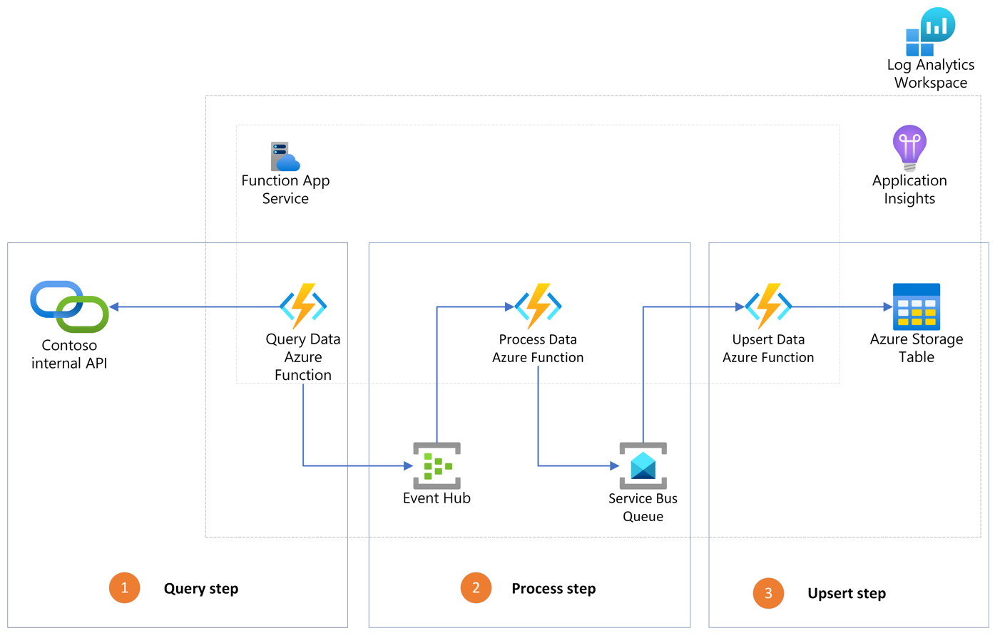

# observable-azure-functions

We present a sample code that showcases observable use Azure Functions.
We provide:

- Python code using OpenCensus
- code to deploy the sample infrastructure
- code to publish the Azure Function App

This sample supports the "End-to-end monitoring of a distributed system: a case in point with Azure Functions and OpenCensus" Azure Architecture Center.

## Architecture

The sample architecture relies on:

- Azure Functions: a service that provides managed serverless to run your applications.

- Azure Event Hubs: a scalable event ingestion service that can receive and process millions of events per second.

- Azure Service Bus: a fully managed message broker with message queues and publish-subscribe topics.

- Azure Table Storage: a service that stores non-relational structured data (also known as structured NoSQL data) in the cloud, providing a key/attribute store with a schemaless design.

- Application Insights: Application Insights is a feature of Azure Monitor and is useful to monitor applications from development, through test, and into production in the following ways:

    1. Proactively understand how an application is performing.
    1. Reactively review application execution data to determine the cause of an incident. 

## Scenario

Contoso, like many companies, has the need to ingest on-premises or third-party data in the cloud as. , they collect data about their sales using different services and in-house tools. One of their department has built an internal API that exposes that exposes the unstructured data, and they would like to ingest it in a common storage that contains structured data from all the departments of the company storage. To do this, Contoso builds the following distributed architecture to extract, process and ingest that metadata in the cloud:



1) **Query step**

    A timer-triggered Azure function that queries a Contoso internal API to get the latest sales data metadata once a day. It then uses the Azure Event Hub output binding to send the data as events.

2) **Process step**

    An Event-hub-triggered Azure function processes and formats the unstructured data received to a pre-defined structured format. It then publishes one message to Azure Service Bus per asset that needs to be imported, using the Azure Service Bus output binding.

3) **Upsert step**

    A Service-bus-triggered Azure function consumes messages from the queue and launches an upsert operation upsert operation.in the common company storage.

## Pre-requirements

- Access to an Azure Subscription
- An existing resource group
- Docker installed

## Instructions

We need to deploy both the infrastructure and the Azure Function App.

1. Open the folder in the dev container.

1. Create a virtual environment. From the root directory, launch:

    ```bash
        make create-env
    ```


1. Deploy the infrastructure, following one of those two options:
    1. **Option 1:** Using the following "Deploy to Azure button". Make sure to sign-in to your Azure account and select the right subscription and resource group:

        [ADD buton "DEPLOY TO AZURE"]

        Then, copy the ```config/.env.SAMPLE``` to ```config/.env``` and fill thee following required environment variables. You can find the values of ```TENANT_ID```, ```SUBSCRIPTION_ID```, ```RESOURCE_GROUP_NAME``` in the Azure portal. Choose a ```DEPLOYMENT_NAME```

        ```bash
        TENANT_ID= 
        SUBSCRIPTION_ID= 
        RESOURCE_GROUP_NAME=
        DEPLOYMENT_NAME=
        ```

    1. **Option 2:** Using the existing infrastructure deployment scipt. Copy the ```config/.env.SAMPLE``` to ```config/.env``` and fill thee following required environment variables. You can find the values of ```TENANT_ID```, ```SUBSCRIPTION_ID```, ```RESOURCE_GROUP_NAME``` in the Azure portal. Choose a ```DEPLOYMENT_NAME```

        ```bash
        TENANT_ID= 
        SUBSCRIPTION_ID= 
        RESOURCE_GROUP_NAME=
        DEPLOYMENT_NAME=
        ```

    Then launch the following command:

    ```bash
    make deploy-infra
    ```

1. Publish the Azure Function App:

    ```bash
    make deploy-app
    ```

Note: If you want to both deploy the infrastructure and deploy the Azure Function App, you can do:

```bash
make deploy-all
```

## Contributing

This project welcomes contributions and suggestions.  Most contributions require you to agree to a
Contributor License Agreement (CLA) declaring that you have the right to, and actually do, grant us
the rights to use your contribution. For details, visit https://cla.opensource.microsoft.com.

When you submit a pull request, a CLA bot will automatically determine whether you need to provide
a CLA and decorate the PR appropriately (e.g., status check, comment). Simply follow the instructions
provided by the bot. You will only need to do this once across all repos using our CLA.

This project has adopted the [Microsoft Open Source Code of Conduct](https://opensource.microsoft.com/codeofconduct/).
For more information see the [Code of Conduct FAQ](https://opensource.microsoft.com/codeofconduct/faq/) or
contact [opencode@microsoft.com](mailto:opencode@microsoft.com) with any additional questions or comments.

## Trademarks

This project may contain trademarks or logos for projects, products, or services. Authorized use of Microsoft 
trademarks or logos is subject to and must follow 
[Microsoft's Trademark & Brand Guidelines](https://www.microsoft.com/en-us/legal/intellectualproperty/trademarks/usage/general).
Use of Microsoft trademarks or logos in modified versions of this project must not cause confusion or imply Microsoft sponsorship.
Any use of third-party trademarks or logos are subject to those third-party's policies.